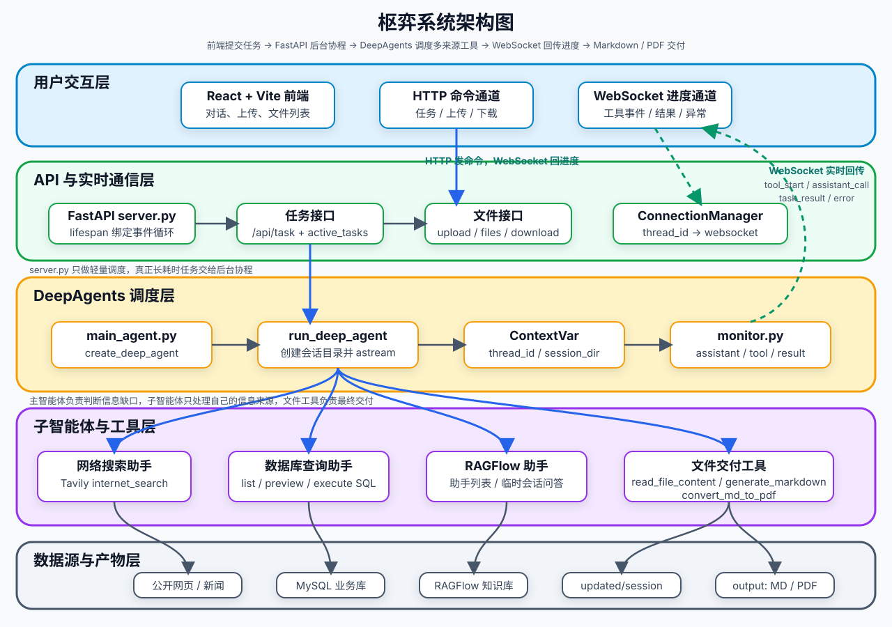
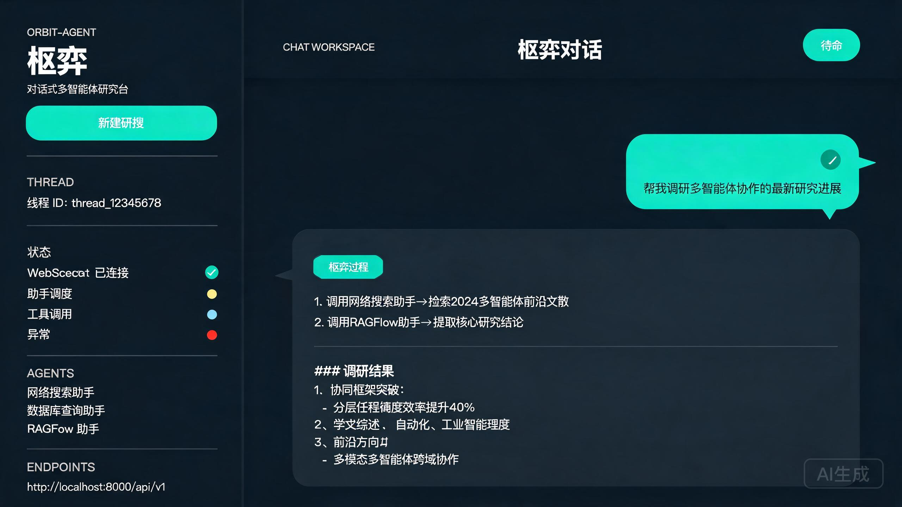

<div align="center">
  <h1>Orbit-Agent</h1>
  <p><em>基于 DeepAgents 的对话式多智能体深度研究系统</em></p>
  <p><strong> 多源信息检索 · 自动交付 Markdown / PDF 报告</strong></p>
</div>

## 📖 项目简介

**Orbit-Agent（枢弈）** 是一个对话式多智能体深度研究系统：输入一个研究任务，主智能体负责任务规划与调度，三个专家子智能体分别从**互联网、MySQL 数据库、RAGFlow 私有知识库**三类信息源检索数据，最终汇总生成 Markdown / PDF 交付物，全过程通过 **WebSocket** 实时推送到 React 前端。

一个典型任务的样子：

```text
结合公开资料、数据库信息和我上传的文档，整理一份机器人行业研究报告，并生成 PDF。
```

系统背后的执行链路：

```text
用户任务
  -> FastAPI 接收请求，创建会话目录
  -> 主智能体分析任务并规划步骤
  -> 分派给网络搜索 / 数据库查询 / RAGFlow 知识库助手
  -> 主智能体汇总多来源信息
  -> 调用文件工具生成 Markdown / PDF
  -> monitor 通过 WebSocket 推送全过程事件
  -> 前端实时展示事件流、答案与文件列表
```

> 本项目为**独立开发**，用于系统性实践多智能体编排、RAG 检索、工具调用、会话持久化与工程化治理能力。

## 🏗️ 系统架构



采用 DeepAgents 的 **Orchestrator-Workers** 模式：

| 归属 | 能力 | 工具 |
| --- | --- | --- |
| 主智能体 | 任务规划、助手调度、结果汇总、文件交付、多模态理解与生成 | `read_file_content` / `generate_markdown` / `convert_md_to_pdf` / `analyze_image` / `generate_image` / `transcribe_audio` |
| 网络搜索助手 | 查询互联网公开信息 | `internet_search`（Tavily） |
| 数据库查询助手 | 发现表结构、执行 SQL | `list_sql_tables` / `get_table_data` / `execute_sql_query` |
| RAGFlow 助手 | 私有知识库问答 | `get_assistant_list` / `create_ask_delete` |

## ✨ 核心特性

- **多智能体编排**：一个主智能体 + 三个专家子智能体，各持工具、上下文隔离，主智能体通过任务描述驱动子智能体。
- **多源信息融合**：互联网公开信息（Tavily）、结构化业务数据（MySQL）、私有非结构化文档（RAGFlow）三类来源统一汇总。
- **多模态输入输出**：图片理解（`analyze_image`，qwen-vl-max）、文生图（`generate_image`，qwen-image-3.0）、语音转写（`transcribe_audio`，qwen-audio-3.0-asr-flash），支持上传图片/录音作为任务输入。
- **会话级上下文隔离**：`ContextVar` 携带 `thread_id` 与 `session_dir`，深层工具无需显式传参即可获取会话身份，各会话文件互不干扰。
- **事件驱动前后端联动**：工具调用、子智能体调用、任务结果、取消与异常统一以 WebSocket 事件推送前端。
- **会话持久化与断点恢复**：基于 `AsyncSqliteSaver`（WAL 模式），服务重启后可恢复历史会话上下文。
- **前端会话历史**：会话列表与对话记忆存 localStorage，可切换查看与删除历史对话；仅登记有真实对话内容的会话。
- **安全防护**：SQL 注入防护（仅 SELECT/SHOW）、行数/超时限制、表名白名单、文件上传大小与扩展名校验、路径穿越防护。
- **检索缓存**：Tavily 搜索与 RAGFlow 助手列表接入 Redis TTL 缓存，连接失败时静默降级。
- **可观测性**：LangSmith 零代码链路追踪 + 工具/助手耗时埋点。
- **并发治理**：基于 `asyncio.Semaphore` 限制同时执行的任务数（`TASK_CONCURRENCY` 可调），防止并发任务打爆内存与大模型配额。



## 🛠️ 技术栈

| 模块 | 技术 |
| --- | --- |
| 智能体框架 | DeepAgents 0.5.7 / LangGraph 1.1.10 / LangChain 1.2.17 |
| 大模型接入 | OpenAI 兼容接口（主智能体 `qwen-vl-max` 多模态、子智能体 `qwen-max`） |
| 检索与数据 | Tavily / MySQL / RAGFlow（`ragflow-sdk`） |
| 文档处理 | pypdf / python-docx / pandas / ReportLab（Markdown → PDF） |
| 后端 | FastAPI + Uvicorn + WebSocket（Python 3.12） |
| 前端 | React 19 + Vite + TypeScript + Ant Design 5 + Tailwind 4 |
| 缓存 / 观测 / 持久化 | Redis（可选降级）/ LangSmith（可选）/ SQLite checkpoint |
| 工程化 | uv / pnpm / pre-commit / Docker Compose |

## 📁 项目结构

```text
orbit-agent/
├── app/                          # 后端主包
│   ├── agent/                    # 智能体组装
│   │   ├── subagents/            # 网络搜索 / 数据库查询 / RAGFlow 三个子智能体
│   │   ├── llm.py                # OpenAI 兼容模型初始化
│   │   ├── main_agent.py         # 主智能体组装与 run_deep_agent 执行入口
│   │   └── prompts.py            # 提示词加载
│   ├── api/                      # HTTP/WebSocket 接口层
│   │   ├── context.py            # ContextVar 会话上下文
│   │   ├── monitor.py            # 事件监控与 WebSocket 管理
│   │   └── server.py             # FastAPI 路由
│   ├── data/                     # SQLite checkpoint 数据库（运行期生成）
│   ├── prompt/prompts.yml        # 主/子智能体提示词配置
│   ├── ragflow/                  # RAGFlow 配置与示例
│   ├── tools/                    # LangChain 工具实现（检索 + 文件 + 多模态）
│   └── utils/                    # 缓存 / 安全 / 路径解析 / 文档转换
├── docker/                       # 本地 MySQL 教学环境（药品/库存/销售数据）
│   ├── docker-compose.yaml
│   └── mysql/mysql.sql
├── docs/                         # 项目记忆（PROJECT_MEMORY）、知识库示例
├── frontend/                     # React 前端
├── scripts/                      # 调试 / 测试 / 运维脚本
├── pyproject.toml                # Python 依赖与元信息
├── uv.lock                       # uv 锁文件
└── .env.example                  # 环境变量模板
```

## 🚀 快速开始

### 环境要求

- Python **3.12**+ [uv](https://docs.astral.sh/uv/)
- Node.js + pnpm
- Docker（MySQL 教学库）
- 大模型 API Key（OpenAI 兼容）、Tavily API Key；RAGFlow 为可选依赖

### 后端

```bash
git clone https://github.com/wjb412530/Orbit-Agent.git
cd Orbit-Agent
uv sync                          # 安装依赖
cp .env.example .env             # 配置模型 / 搜索 / 数据库密钥
docker compose -f docker/docker-compose.yaml up -d   # 启动 MySQL 教学库
uv run uvicorn app.api.server:app --host 0.0.0.0 --port 8000 --reload
```

### 前端

```bash
cd frontend
pnpm install
pnpm dev          # 开发服务器（vite 代理 /api → 8000、/ws → ws:8000）
pnpm test         # 前端单元测试（vitest）
pnpm build        # 生产构建
```

### 试几个任务

```text
从数据库中查询心血管药品的库存情况，并生成 Markdown 报告。
搜索 2026 年 AI 在电商行业的应用趋势，并结合知识库资料生成一份 PDF。
请先读取我上传的行业报告，再结合公开资料整理一份研究摘要。
上传一张产品图，描述图中内容并生成一张配图插画。
上传一段会议录音，转写文字并整理成会议纪要。
```

## 🔌 API 参考

| 接口 | 说明 |
| --- | --- |
| `POST /api/task` | 启动一次 DeepAgents 后台任务（`{query, thread_id}`） |
| `POST /api/task/{thread_id}/cancel` | 取消指定会话任务 |
| `POST /api/upload` | 上传文件到当前会话 |
| `DELETE /api/upload/{thread_id}/{filename}` | 删除当前会话已上传的文件 |
| `GET /api/files` | 列出指定目录下的生成文件 |
| `GET /api/download` | 下载输出目录内的文件 |
| `GET /api/sessions` | 查询历史会话列表（会话持久化） |
| `WebSocket /ws/{thread_id}` | 实时推送执行事件 |

## ⚙️ 配置说明

完整模板见 `.env.example`，主要分为：

- **LLM**：`OPENAI_BASE_URL` / `OPENAI_API_KEY` / `LLM_QWEN_MAX`（子智能体文本模型）/ `LLM_QWEN_VL`（主智能体多模态模型）
- **检索**：`TAVILY_API_KEY`、`RAGFLOW_API_URL` / `RAGFLOW_API_KEY`
- **数据库**：`MYSQL_*`（默认端口 3307）
- **缓存**：`REDIS_ENABLED` / `REDIS_URL` / `SEARCH_CACHE_TTL`
- **安全**：`ALLOWED_SQL_TABLES` / `SQL_QUERY_TIMEOUT` / `SQL_MAX_ROWS` / `MAX_UPLOAD_MB` / `ALLOWED_FILE_EXTENSIONS`（含图片/音频格式）
- **多模态（可选）**：`QWEN_IMAGE_MODEL` / `DASHSCOPE_IMAGE_URL`（文生图）、`QWEN_ASR_MODEL` / `DASHSCOPE_ASR_URL`（语音转写）
- **观测**：`LANGSMITH_API_KEY` / `LANGSMITH_TRACING`
- **持久化**：`CHECKPOINT_DB_PATH` / `SESSION_EXPIRE_DAYS`
- **并发**：`TASK_CONCURRENCY`（默认 2，同时执行任务数上限）

## 📚 文档

- 项目完整记忆（架构 / 模块职责 / 环境变量 / 迁移步骤 / 代码级补充说明）：[docs/PROJECT_MEMORY.md](docs/PROJECT_MEMORY.md)

## License

[MIT](LICENSE)
