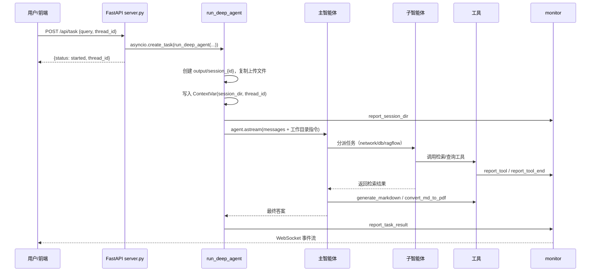
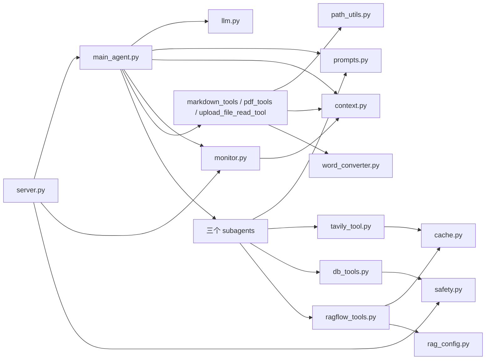

# Orbit-Agent 代码文档（Code Wiki）

> 本文档为 `Orbit-Agent` 仓库的结构化代码说明，覆盖整体架构、模块职责、关键类与函数、依赖关系与运行方式。生成时间：2026-09-07。

---

## 目录

1. [项目概览](#1-项目概览)
2. [技术栈](#2-技术栈)
3. [整体架构](#3-整体架构)
4. [目录结构](#4-目录结构)
5. [后端模块详解](#5-后端模块详解)
   - 5.1 API 层 (`app/api/`)
   - 5.2 Agent 层 (`app/agent/`)
   - 5.3 工具层 (`app/tools/`)
   - 5.4 工具函数层 (`app/utils/`)
   - 5.5 RAGFlow 层 (`app/ragflow/`)
   - 5.6 提示词配置 (`app/prompt/`)
6. [前端模块详解](#6-前端模块详解)
7. [关键类与函数索引](#7-关键类与函数索引)
8. [数据模型（MySQL）](#8-数据模型mysql)
9. [WebSocket 事件协议](#9-websocket-事件协议)
10. [配置说明](#10-配置说明)
11. [依赖关系](#11-依赖关系)
12. [运行方式](#12-运行方式)
13. [扩展点与开发模式](#13-扩展点与开发模式)

---

## 1. 项目概览

**Orbit-Agent** 是一个基于 [DeepAgents](https://github.com/langchain-ai/deepagents) 框架的**对话式多智能体深度研究系统**。

核心工作模式为「Orchestrator-Workers」：一个**主智能体**负责理解任务、规划步骤、调度子智能体并汇总结果；三个**专家子智能体**分别从不同信息源获取数据；最终由主智能体调用文件工具生成 Markdown / PDF 交付物。全过程通过 **WebSocket** 实时推送到 React 前端。

| 角色 | 职责 | 持有的工具 |
| --- | --- | --- |
| 主智能体 (Main Agent) | 任务规划、子智能体调度、结果合成、文件交付 | `read_file_content`、`generate_markdown`、`convert_md_to_pdf` |
| 网络搜索助手 | 检索互联网公开信息 | `internet_search`（Tavily） |
| 数据库查询助手 | 查询 MySQL 结构化业务数据 | `list_sql_tables`、`get_table_data`、`execute_sql_query` |
| RAGFlow 助手 | 检索企业私有知识库（非结构化文档） | `get_assistant_list`、`create_ask_delete` |

一个典型任务示例：

```text
结合公开资料、数据库信息和我上传的文档，整理一份机器人行业研究报告，并生成 PDF。
```

---

## 2. 技术栈

| 模块 | 技术 |
| --- | --- |
| 智能体框架 | DeepAgents 0.5.7 / LangGraph 1.1.10 / LangChain 1.2.17 |
| 大模型接入 | OpenAI 兼容接口（默认通义千问 `qwen-max`） |
| 检索与数据 | Tavily / MySQL / RAGFlow（`ragflow-sdk`） |
| 文档处理 | pypdf / python-docx / pandas / ReportLab（Markdown → PDF） |
| 后端 | FastAPI + Uvicorn + WebSocket，Python 3.12 |
| 前端 | React 19 + Vite + TypeScript + Ant Design 5 + Tailwind 4 |
| 工程化 | uv（依赖管理）/ pnpm / pre-commit / Docker Compose |
| 缓存 / 观测 / 持久化 | Redis（可选降级）/ LangSmith（可选）/ SQLite checkpoint |

---

## 3. 整体架构

### 3.1 组件关系图

```mermaid
flowchart TD
    FE[React 前端<br/>App / useDeepAgentSession] <-->|HTTP REST| API[FastAPI<br/>app/api/server.py]
    FE <-->|WebSocket /ws/{thread_id}| WS[ConnectionManager<br/>app/api/monitor.py]

    API -->|asyncio.create_task| RUN[run_deep_agent<br/>app/agent/main_agent.py]
    RUN --> MA[主智能体 DeepAgent<br/>create_deep_agent]
    MA -->|subagents| SUB1[网络搜索助手]
    MA -->|subagents| SUB2[数据库查询助手]
    MA -->|subagents| SUB3[RAGFlow 助手]
    MA -->|tools| FILE[文件工具<br/>read_file_content / generate_markdown / convert_md_to_pdf]

    SUB1 -->|internet_search| TAVILY[Tavily API]
    SUB2 -->|list/get/execute| MYSQL[MySQL 教学库]
    SUB3 -->|get_assistant_list / create_ask_delete| RAGFLOW[RAGFlow 服务]

    MA -.->|monitor.report_*| MONITOR[ToolMonitor 单例]
    RUN -.->|ContextVar| CTX[app/api/context.py]
    MONITOR --> WS
```

### 3.2 执行流（端到端）



### 3.3 关键工程设计

- **会话级上下文隔离**：用 `ContextVar` 携带 `thread_id` 与 `session_dir`，深层工具无需显式传参即可获取会话身份，各会话文件互不干扰（见 [app/api/context.py](#51-api-层-appapi)）。
- **事件驱动的前后端联动**：工具调用、子智能体调用、任务结果、取消与异常统一由 `monitor` 以 WebSocket 事件推送前端。
- **子智能体各持工具、上下文隔离**：主智能体不直接持有检索类工具，通过任务描述驱动子智能体，控制上下文规模。
- **会话持久化**：使用 `AsyncSqliteSaver`（WAL 模式）替代内存态 checkpointer，服务重启后可断点恢复对话上下文。

---

## 4. 目录结构

```text
Orbit-Agent/
├── app/                          # 后端主包
│   ├── agent/                    # 智能体组装
│   │   ├── subagents/            # 三个子智能体定义
│   │   ├── llm.py                # OpenAI 兼容模型初始化
│   │   ├── main_agent.py         # 主智能体组装与 run_deep_agent 执行入口
│   │   └── prompts.py            # 提示词加载
│   ├── api/                      # HTTP/WebSocket 接口层
│   │   ├── context.py            # ContextVar 会话上下文
│   │   ├── monitor.py            # 事件监控与 WebSocket 管理
│   │   └── server.py             # FastAPI 路由
│   ├── data/                     # SQLite checkpoint 数据库（运行期生成）
│   ├── prompt/prompts.yml        # 主/子智能体提示词配置
│   ├── ragflow/                  # RAGFlow 配置与调用示例
│   ├── tools/                    # 九类 LangChain 工具实现
│   └── utils/                    # 缓存 / 安全 / 路径 / 文档转换
├── docker/                       # 本地 MySQL 教学环境
│   ├── docker-compose.yaml
│   └── mysql/mysql.sql           # 药品/库存/销售初始化数据
├── docs/                         # 设计文档、知识库示例、本 Code Wiki
├── examples/                     # DeepAgents 章节示例脚本（15 个）
├── frontend/                     # React 前端
├── scripts/                      # 调试/测试/运维脚本
├── CLAUDE.md                     # 协作指南
├── pyproject.toml                # Python 依赖与项目元信息
├── requirements.txt              # 依赖快照
└── .env.example                  # 环境变量模板
```

---

## 5. 后端模块详解

### 5.1 API 层 (`app/api/`)

#### 5.1.1 `server.py` — FastAPI 接口与闭环入口

后端对接前端的唯一入口，HTTP 接口只做轻量调度，真正的 Agent 执行放到后台任务。

**全局对象**：

| 名称 | 说明 |
| --- | --- |
| `app` | `FastAPI` 实例，绑定 `lifespan` |
| `active_tasks` | `dict[str, asyncio.Task]`，记录 `thread_id → 后台任务`，用于同会话任务替换与取消 |
| `output_dir` | `app/output/`，各会话最终工作区 |
| `updated_dir` | `app/updated/`，用户上传文件暂存区 |

**接口清单**：

| 方法与路径 | 处理函数 | 说明 |
| --- | --- | --- |
| `POST /api/task` | `run_task` | 创建后台协程执行 Agent，立即返回 `thread_id` |
| `POST /api/task/{thread_id}/cancel` | `cancel_task` | 取消指定会话任务 |
| `POST /api/upload` | `upload_files` | 上传文件到 `updated/session_{thread_id}`，含安全校验 |
| `GET /api/download` | `download_file` | 按路径下载，仅允许 `output_dir` 内文件 |
| `GET /api/files` | `list_files` | 递归列出指定目录文件元数据 |
| `GET /api/sessions` | `list_sessions` | 从 checkpoint 库查询历史会话（项目 4） |
| `WS /ws/{thread_id}` | `websocket_endpoint` | 建立 WebSocket 连接并处理心跳 |

关键函数说明：

- `run_task(request)`：同一 `thread_id` 只保留一个活跃任务，新任务先 `cancel` 旧任务，再 `asyncio.create_task(run_deep_agent(...))`。
- `upload_files(files, thread_id)`：调用 `validate_file_upload` 校验大小与扩展名白名单，通过 `shutil.copyfileobj` 流式落盘。
- `download_file` / `list_files`：均以 `Path.resolve()` + `is_relative_to(output_abs)` 做路径穿越防护。

#### 5.1.2 `context.py` — 请求上下文管理

用 `contextvars.ContextVar` 保存当前任务的会话身份，供深层工具/监控模块无需传参直接读取。

| 函数 | 说明 |
| --- | --- |
| `set_session_context(path)` | 设置会话目录，返回 `Token` |
| `get_session_context()` | 读取会话目录 |
| `set_thread_context(thread_id)` | 设置线程 ID，返回 `Token` |
| `get_thread_context()` | 读取线程 ID |
| `reset_session_context(session_token, thread_token)` | 恢复上下文，避免请求间串台 |

两个 ContextVar：`_session_dir_ctx`、`_thread_id_ctx`（默认 `None`）。

#### 5.1.3 `monitor.py` — 事件监控与 WebSocket 管理

**`ToolMonitor`（单例，全局 `monitor`）**：统一监控入口，业务工具调用其 `report_*` 方法即可，内部处理「WebSocket 推送 / stream_writer / 控制台」三种输出。

| 方法 | 报告事件 |
| --- | --- |
| `report_tool(tool_name, args)` | `tool_start` |
| `report_tool_end(tool_name, start_time, result)` | `tool_end`（含耗时） |
| `report_assistant(assistant_name, args)` | `assistant_call` |
| `report_assistant_end(assistant_name, start_time)` | `assistant_end`（含耗时） |
| `report_task_result(result)` | `task_result` |
| `report_task_cancelled()` | `task_cancelled` |
| `report_session_dir(path)` | `session_created` |
| `_emit(event_type, message, data)` | 内部统一构造 payload 并分发 |
| `_send_to_websocket(payload, thread_id, loop)` | 跨事件循环线程安全投递 |

**`ConnectionManager`（全局 `manager`）**：以 `thread_id` 为 key 维护活跃 WebSocket 连接。

| 方法 | 说明 |
| --- | --- |
| `set_loop(loop)` | 绑定 FastAPI 主事件循环，并注册到 `monitor` |
| `connect(ws, thread_id)` | `accept` 后按 `thread_id` 保存连接 |
| `disconnect(ws, thread_id)` | 仅移除同一个实例，避免误删新连接 |
| `send_to_thread(message, thread_id)` | 向指定会话连接发送 JSON |

> 事件 payload 统一形如 `{"type":"monitor_event","event":..., "message":..., "data":..., "timestamp":...}`。

---

### 5.2 Agent 层 (`app/agent/`)

#### 5.2.1 `llm.py` — 模型初始化

- 使用 `python-dotenv` 的 `find_dotenv()` + `load_dotenv()` 自动定位 `.env`。
- 通过 `langchain.chat_models.init_chat_model(model=LLM_QWEN_MAX, model_provider="openai")` 创建单一全局模型对象 `model`，供主/子智能体共用。

#### 5.2.2 `prompts.py` — 提示词加载

- `load_yaml(path)`：用 `yaml.safe_load` 安全读取 YAML。
- 模块级变量 `main_agent_content`（`prompts.yml` 的 `main_agent` 段落）与 `sub_agents_content`（`sub_agents` 段落），供子智能体与主智能体组装时复用。

#### 5.2.3 `main_agent.py` — 主智能体组装与执行

**单例对象**：

| 对象 | 说明 |
| --- | --- |
| `get_checkpointer()` | 懒加载 `AsyncSqliteSaver`（`aiosqlite` 连接 + `PRAGMA journal_mode=WAL`），首次调用执行 `setup()` 建表 |
| `get_main_agent()` | 懒加载 `create_deep_agent(...)` 主智能体实例 |

主智能体组装参数：

```python
create_deep_agent(
    model=model,
    system_prompt=main_agent_content["system_prompt"],
    tools=[generate_markdown, convert_md_to_pdf, read_file_content],
    checkpointer=checkpointer,
    subagents=[database_query_agent, network_search_agent, knowledge_base_agent],
)
```

**核心入口 `run_deep_agent(task_query, session_id)`**：

1. 创建 `output/session_{session_id}` 工作目录。
2. 若有上传文件，从 `updated/session_{session_id}` 用 `shutil.copy2` 复制到工作目录，并生成「已上传文件」提示注入用户消息。
3. 写入 ContextVar，`monitor.report_session_dir` 上报目录。
4. 构造 `config = {"configurable": {"thread_id": session_id}}`（checkpointer 会话隔离关键）。
5. 拼接「工作环境指令」约束模型只在会话目录读写，且先读上传文件。
6. `agent.astream(...)` 流式执行，解析 chunk：`model` 节点中的 `tool_call["name"] == "task"` 视为子智能体调用（`report_assistant`）；纯文本内容视为最终结果（`report_task_result`）。
7. 捕获 `CancelledError`、异常，`finally` 中恢复 ContextVar。

#### 5.2.4 `subagents/` — 三个子智能体定义

每个子智能体都是一个由 `prompts.yml` + 工具组合成的**字典对象**（DeepAgents 可识别）：

| 文件 | 对象 | 字段 | 工具 |
| --- | --- | --- | --- |
| `network_search_agent.py` | `network_search_agent` | `name/description/system_prompt/tools` | `internet_search` |
| `database_query_agent.py` | `database_query_agent` | 同上 | `list_sql_tables, get_table_data, execute_sql_query` |
| `knowledge_base_agent.py` | `knowledge_base_agent` | 同上 | `get_assistant_list, create_ask_delete` |

`name`、`description`（主智能体路由依据）、`system_prompt`（约束子智能体行为）均来自 `sub_agents_content`。

---

### 5.3 工具层 (`app/tools/`)

所有工具均用 LangChain `@tool` 装饰器标记，`signature` 与 `docstring` 会被暴露给模型以决定调用与填参。工具共 9 个，分属 6 个文件。

| 文件 | 工具函数 | 归属 | 说明 |
| --- | --- | --- | --- |
| `tavily_tool.py` | `internet_search(query, topic, max_results, include_raw_content)` | 网络搜索助手 | Tavily 检索，带 Redis 缓存 |
| `db_tools.py` | `list_sql_tables()` | 数据库助手 | `SHOW TABLES` 列出表名 |
| `db_tools.py` | `get_table_data(table_name)` | 数据库助手 | 预览表前 N 行（CSV 返回） |
| `db_tools.py` | `execute_sql_query(query)` | 数据库助手 | 自定义 SQL（仅 SELECT/SHOW） |
| `ragflow_tools.py` | `get_assistant_list()` | RAGFlow 助手 | 列出聊天助手及绑定知识库 |
| `ragflow_tools.py` | `create_ask_delete(chat_name, question)` | RAGFlow 助手 | 建临时会话提问后删除 |
| `markdown_tools.py` | `generate_markdown(content, filename, path)` | 主智能体 | 生成 Markdown |
| `pdf_tools.py` | `convert_md_to_pdf(md_filename, pdf_filename)` | 主智能体 | Markdown → PDF |
| `upload_file_read_tool.py` | `read_file_content(filename, instruction)` | 主智能体 | 读取上传文件（md/txt/docx/pdf/xlsx） |

工具要点：

- **数据库工具**统一通过 `get_db_config()` 读取连接参数，且所有查询类工具都先经 `monitor.report_tool` 埋点。
- **RAGFlow `create_ask_delete`** 通过底层 `post` 调用 `/chats/{id}/completions` 流式接口，兼容 SSE 增量/全量两种返回，查询结束删除临时会话。
- **文件工具**均通过 `get_session_context()` 获取会话目录，再经 `resolve_path` 统一清洗路径。

---

### 5.4 工具函数层 (`app/utils/`)

#### 5.4.1 `cache.py` — Redis 缓存（项目 1，可降级）

| 函数 | 说明 |
| --- | --- |
| `get_redis_client()` | 懒加载 Redis 客户端；未启用或连接失败返回 `None` |
| `generate_cache_key(prefix, *args)` | JSON + MD5 生成 `prefix:hash` 键 |
| `cache_get(key)` | 读取并反序列化，异常均返回 `None` |
| `cache_set(key, value, ttl)` | 序列化写入，默认 TTL `SEARCH_CACHE_TTL` |
| `cache_delete(key)` | 删除键 |
| `is_cache_enabled()` | 是否可用 |

设计原则：Redis 连接失败或操作异常时**静默降级**，不影响主业务流程。

#### 5.4.2 `safety.py` — 安全防护（项目 2）

| 函数 | 说明 |
| --- | --- |
| `validate_sql_query(sql)` | 仅允许 `SELECT/SHOW`，拦截危险关键字、注释注入、多语句 |
| `limit_sql_rows(sql, max_rows)` | 自动追加/修正 `LIMIT` |
| `validate_table_name(table_name, allowed_tables)` | 表名格式校验 + 白名单 |
| `validate_file_upload(filename, size_mb, ...)` | 文件大小、扩展名白名单、非法字符校验 |
| `get_security_config()` | 从环境变量读取安全配置字典 |

#### 5.4.3 `path_utils.py` — 路径解析

- `resolve_path(filename, session_dir)`：把模型/工具返回的虚拟路径、上传路径、相对路径统一转成本地绝对路径，并尽量限制在会话目录内；剥离 `/workspace`、`/mnt/data` 等沙箱前缀。
- `_fix_nested_session_path(...)`：修正 `session_xxx/session_xxx/file.md` 重复嵌套。

#### 5.4.4 `word_converter.py` — Markdown → PDF

- `convert_md_to_pdf(md_abs_path, pdf_abs_path)`：读取 Markdown，用 ReportLab `SimpleDocTemplate` 生成 PDF。
- 辅助函数：`_register_fonts`（注册中文 `STSong-Light` CID 字体）、`_build_styles`、`_markdown_to_story`（解析标题/列表/代码块/表格）、`_parse_heading`、`_parse_bullet`、`_is_table_start`、`_collect_table`、`_split_table_row`、`_build_table`、`_format_inline`。

> 该方案不依赖 Word/浏览器/系统 PDF 工具，跨平台可用。

---

### 5.5 RAGFlow 层 (`app/ragflow/`)

| 文件 | 说明 |
| --- | --- |
| `rag_config.py` | `_load_ragflow_env()` 读取 `RAGFLOW_API_KEY` / `RAGFLOW_API_URL`，供 SDK 初始化复用 |
| `knowledge_demo.py` | RAGFlow 原始 SDK 调用示例 |

---

### 5.6 提示词配置 (`app/prompt/prompts.yml`)

集中管理所有智能体的 `name` / `description` / `system_prompt`：

- `main_agent.system_prompt`：定义主智能体「先获取信息、再生成文档」的工作流，含关键执行顺序约束（必须先调用子智能体获取信息，再调用生成工具）。
- `sub_agents.tavily / db / ragflow`：分别约束三个子智能体的工具使用顺序与检索策略（如网络搜索「至少 3 个角度、至多 5 次检索」）。

修改后需重启服务（或重建 Agent 实例）才会生效。

---

## 6. 前端模块详解

前端为 React + Vite + TS + Ant Design，核心逻辑集中在 `useDeepAgentSession` Hook，页面组件在 `src/components/`。

### 6.1 `lib/` 基础库

| 文件 | 导出 | 说明 |
| --- | --- | --- |
| `config.ts` | `API_BASE_URL`, `WS_BASE_URL` | 读取 `VITE_API_BASE_URL` / `VITE_WS_BASE_URL`，自动推导 ws/wss |
| `api.ts` | `startTask`, `cancelTask`, `uploadSessionFiles`, `listSessionFiles`, `getDownloadUrl` | 封装 REST 调用；`requestJson` 统一处理错误体 |
| `thread.ts` | `createThreadId`, `getStoredThreadId`, `storeThreadId` | `thread_id` 的生成与 `localStorage` 持久化 |
| `types.ts` | 各类类型定义 | `MonitorMessage`、`SocketMessage`、`OutputFile`、`TaskResponse` 等 |

### 6.2 `hooks/useDeepAgentSession.ts` — 核心状态管理

单一 Hook 管理整个会话生命周期：

- **WebSocket 连接**：建立 `/ws/{thread_id}` 连接，25s 心跳 `ping`，断线 2s 自动重连。
- **事件流**：`onmessage` 解析 `monitor_event`，维护最多 120 条事件；对 `session_created` / `task_result` / `task_cancelled` / `error` 分别更新状态。
- **文件刷新**：`sessionPath` 就绪后周期调用 `listSessionFiles`（运行中 2.5s / 空闲 6s）。
- **动作**：`submitTask`、`cancelCurrentTask`、`uploadFiles`、`resetSession`、`refreshFiles`。
- **统计**：`stats` 汇总 `toolEvents` / `assistantEvents` / `errorEvents` / `fileCount`。

### 6.3 `App.tsx` — 应用根组件

布局为「侧边栏（会话/状态/Agent 列表）+ 主聊天区」。使用 `useDeepAgentSession` 管理状态，协调任务提交、取消、上传与新会话。

### 6.4 `components/` 组件清单

| 组件 | 说明 | 当前是否接入 App |
| --- | --- | --- |
| `ChatComposer` | 输入框 + 文件上传 + 提交/取消按钮 | ✅ 已接入 |
| `ConversationThread` | 对话轮次列表（`ChatTurn`），内含 `MarkdownRenderer` | ✅ 已接入 |
| `MarkdownRenderer` | `react-markdown` + `remark-gfm` 渲染 Markdown | ✅ 被 ConversationThread 使用 |
| `EventStream` | 展示事件流 | 辅助组件 |
| `FileDock` | 文件列表面板 + 下载 | 辅助组件 |
| `ResultPanel` | 结果展示 + 复制 | 辅助组件 |
| `StatusStrip` | 连接状态条 | 辅助组件 |
| `UploadPanel` | 上传面板 | 辅助组件 |
| `AgentTopology` | 三个子智能体拓扑展示 | 辅助组件 |
| `MissionComposer` | 任务输入（早期版本） | 辅助组件 |

> 「辅助组件」指已实现但未被当前 `App.tsx` 直接引用的组件，可作独立 UI 单元复用。

---

## 7. 关键类与函数索引

### 7.1 后端

| 位置 | 符号 | 类型 | 职责 |
| --- | --- | --- | --- |
| `server.py` | `app` | FastAPI 实例 | 后端服务入口 |
| `server.py` | `run_deep_agent` 调用方 | — | 后台任务调度 |
| `server.py` | `TaskRequest` | Pydantic 模型 | 请求体 `{query, thread_id}` |
| `context.py` | `_session_dir_ctx` / `_thread_id_ctx` | ContextVar | 会话上下文存储 |
| `monitor.py` | `ToolMonitor` | 类（单例） | 事件上报 |
| `monitor.py` | `ConnectionManager` | 类 | WebSocket 连接管理 |
| `main_agent.py` | `get_checkpointer` | async 函数 | 懒加载 SQLite checkpointer |
| `main_agent.py` | `get_main_agent` | async 函数 | 懒加载主智能体 |
| `main_agent.py` | `run_deep_agent` | async 函数 | 任务执行入口 |
| `llm.py` | `model` | 模型对象 | 全局复用的大模型 |
| `prompts.py` | `main_agent_content` / `sub_agents_content` | dict | 提示词配置 |
| `utils/cache.py` | `get_redis_client` 等 | 函数 | Redis 缓存 |
| `utils/safety.py` | `validate_sql_query` 等 | 函数 | 安全校验 |
| `utils/path_utils.py` | `resolve_path` | 函数 | 路径解析 |
| `utils/word_converter.py` | `convert_md_to_pdf` | 函数 | 文档转换 |

### 7.2 前端

| 位置 | 符号 | 说明 |
| --- | --- | --- |
| `hooks/useDeepAgentSession.ts` | `useDeepAgentSession` | 会话状态与 WS 管理 Hook |
| `lib/api.ts` | `startTask` 等 | REST API 封装 |
| `lib/thread.ts` | `createThreadId` 等 | thread_id 管理 |
| `App.tsx` | `App` | 根组件 |

---

## 8. 数据模型（MySQL）

初始化脚本 `docker/mysql/mysql.sql`，库名 `deepsearch_db`，字符集 `utf8mb4`。三张表：

| 表 | 关键字段 | 说明 |
| --- | --- | --- |
| `drugs` | `drug_id`(PK), `generic_name`, `brand_name`, `approval_number`, `specifications`, `dosage_form`, `manufacturer`, `therapeutic_area`, `description` | 药品主数据（50 条） |
| `inventory` | 关联 `drug_id` | 库存批次（每药 3 批，共 150 条） |
| `sales_records` | 关联 `drug_id` | 销售记录（每药 2 条，共 100 条） |

数据关系：`inventory` 与 `sales_records` 均通过 `drug_id` 外键关联 `drugs`，数据为教学模拟，不用于真实合规判断。

---

## 9. WebSocket 事件协议

前端订阅 `WS /ws/{thread_id}`，服务端推送上表事件。消息统一结构：

```json
{
  "type": "monitor_event",
  "event": "<事件名>",
  "message": "<人类可读描述>",
  "data": { ... },
  "timestamp": "ISO8601"
}
```

| `event` | 触发 | `data` 含义 |
| --- | --- | --- |
| `session_created` | 任务开始创建目录 | `{path}` |
| `tool_start` | 工具开始 | `{tool_name, args}` |
| `tool_end` | 工具结束 | `{tool_name, duration_ms, result}` |
| `assistant_call` | 子智能体被调用 | `{assistant_name, args}` |
| `assistant_end` | 子智能体结束 | `{assistant_name, duration_ms}` |
| `task_result` | 主智能体产出结果 | `{result}` |
| `task_cancelled` | 任务取消 | — |
| `error` | 异常 | message 为错误信息 |

另有 `pong` 消息（`{"type":"pong"}`）响应前端心跳。

---

## 10. 配置说明

完整模板见 `.env.example`，按用途分组：

**LLM**

| 变量 | 说明 |
| --- | --- |
| `OPENAI_BASE_URL` | OpenAI 兼容接口地址 |
| `OPENAI_API_KEY` | 大模型密钥 |
| `LLM_QWEN_MAX` | 模型名（默认 `qwen-max`） |

**Tavily / RAGFlow / MySQL**

| 变量 | 说明 |
| --- | --- |
| `TAVILY_API_KEY` | Tavily 搜索密钥 |
| `RAGFLOW_API_URL` / `RAGFLOW_API_KEY` | RAGFlow 服务地址与密钥 |
| `MYSQL_USER/PASSWORD/DATABASE/HOST/PORT/CHARSET/COLLATION/SQL_MODE` | MySQL 连接（默认端口 3307） |

**Redis 缓存（项目 1）**

| 变量 | 默认 | 说明 |
| --- | --- | --- |
| `REDIS_ENABLED` | `false` | 是否启用缓存 |
| `REDIS_URL` | `redis://localhost:6379/0` | Redis 地址 |
| `SEARCH_CACHE_TTL` | `3600` | 缓存过期秒数 |

**安全防护（项目 2）**

| 变量 | 默认 | 说明 |
| --- | --- | --- |
| `ALLOWED_SQL_TABLES` | 空 | 表名白名单（空=不限制） |
| `SQL_QUERY_TIMEOUT` | `5` | SQL 超时（秒） |
| `SQL_MAX_ROWS` | `100` | 单次查询最大行数 |
| `MAX_UPLOAD_MB` | `20` | 上传大小上限 |
| `ALLOWED_FILE_EXTENSIONS` | `.txt,.md,.pdf,.docx,.xlsx,.csv` | 扩展名白名单 |

**可观测性（项目 3）**

| 变量 | 说明 |
| --- | --- |
| `LANGSMITH_API_KEY` / `LANGSMITH_TRACING` / `TRACING_PROVIDER` | LangSmith 链路追踪 |

**会话持久化（项目 4）**

| 变量 | 默认 | 说明 |
| --- | --- | --- |
| `CHECKPOINT_DB_PATH` | `app/data/checkpoints.db` | checkpoint 数据库路径 |
| `SESSION_EXPIRE_DAYS` | `30` | 会话过期天数 |

---

## 11. 依赖关系

### 11.1 内部依赖（模块间调用）



### 11.2 外部依赖（`pyproject.toml` 摘录）

| 依赖 | 版本 | 用途 |
| --- | --- | --- |
| `deepagents` | `==0.5.7` | 多智能体编排框架 |
| `langchain` / `langgraph` / `langchain-openai` | `1.2.17` / `1.1.10` / `1.2.1` | LangChain / LangGraph 基础设施 |
| `langgraph-checkpoint-sqlite` | `>=3.1.0` | SQLite 会话持久化 |
| `fastapi` / `uvicorn[standard]` | `>=0.100` | Web 服务 |
| `tavily-python` | `==0.7.24` | 网络搜索 |
| `mysql-connector-python` | `>=8.0` | MySQL 连接 |
| `ragflow-sdk` | `>=0.1` | RAGFlow 知识库 |
| `redis` | `>=8.1` | 缓存 |
| `pypdf` / `python-docx` / `pandas` / `reportlab` / `openpyxl` | — | 文档处理 |
| `python-dotenv` / `pydantic` / `pyyaml` / `aiofiles` | — | 基础设施 |

前端依赖见 `frontend/package.json`（React 19、antd 5、react-markdown、tailwind 4、vite 7，包管理器 `pnpm@10.33.0`）。

---

## 12. 运行方式

### 12.1 环境要求

- Python **3.12**（不支持 3.13）+ [uv](https://docs.astral.sh/uv/)
- Node.js + pnpm
- Docker（MySQL 教学库）
- LLM API Key（OpenAI 兼容）、Tavily API Key；RAGFlow 为可选依赖

### 12.2 后端

```bash
git clone https://github.com/wjb412530/Orbit-Agent.git
cd Orbit-Agent
uv sync                              # 安装依赖
cp .env.example .env                 # 配置密钥
docker compose -f docker/docker-compose.yaml up -d   # 启动 MySQL 教学库
uv run uvicorn app.api.server:app --host 0.0.0.0 --port 8000 --reload
```

### 12.3 前端

```bash
cd frontend
pnpm install
pnpm dev      # 开发服务器（vite 代理 /api → 8000、/ws → ws:8000）
pnpm build    # 生产构建
```

### 12.4 示例脚本

```bash
uv run python examples/1-deep-agent-quickstart-search.py
```

`examples/` 下 15 个脚本对应 DeepAgents 教程章节（quickstart、streaming、subagents、nesting、langgraph/langchain wrapper、hitl interrupt、memory backend、middleware、skills 等）。

### 12.5 运维脚本（`scripts/`）

| 脚本 | 说明 |
| --- | --- |
| `init_checkpointer_db.py` | 初始化 checkpoint 数据库表结构 |
| `clean_checkpoints.py` | 按天数/会话清理 checkpoint 并 VACUUM |
| `query_checkpoints.py` / `view_checkpoints.py` / `trace_query.py` | 查询 checkpoint / 轨迹 |
| `test_security.py` / `test_redis_cache.py` / `test_checkpointer.py` / `test_sessions_api.py` 等 | 各类自测脚本 |
| `kill_port_8000.py` / `kill_port_8001.py` | 清理占用端口进程 |
| `submit_test_task.py` | 向 API 提交测试任务 |

---

## 13. 扩展点与开发模式

### 13.1 新增工具

1. 在 `app/tools/` 创建函数（使用 `@tool` 装饰）。
2. 在 `app/agent/subagents/` 或 `app/agent/main_agent.py` 的 `tools=[]` 中导入并添加。
3. 在 `app/prompt/prompts.yml` 更新对应智能体提示词描述新工具。

### 13.2 新增子智能体

1. 在 `app/agent/subagents/` 创建定义文件（字典式，含 `name/description/system_prompt/tools`）。
2. 在 `app/agent/main_agent.py` 的 `subagents=[]` 中添加。
3. 在 `app/prompt/prompts.yml` 的 `sub_agents` 下新增配置段。

### 13.3 会话上下文使用

```python
from app.api.context import get_session_context, get_thread_context
session_dir = get_session_context()   # 返回绝对路径
thread_id = get_thread_context()
```

### 13.4 上报 WebSocket 事件

```python
from app.api.monitor import monitor
monitor.report_tool("工具名", {"arg": "value"})
monitor.report_assistant("助手名", {"description": "..."})
monitor.report_task_result("最终答案")
monitor.report_task_cancelled()
monitor._emit("error", "错误信息")
```

### 13.5 路线图（待实现）

依据 README「改进路线图」，已完成阶段 0~4（CI 骨架 / 检索缓存 / 安全防护 / 可观测性 / 会话持久化），待实现：阶段 5 并发治理（Semaphore）、阶段 7 评测体系、阶段 8 一键部署。

---

## 参考来源

- 项目自述文档：[README.md](../README.md)
- 协作指南：[CLAUDE.md](../CLAUDE.md)
- 环境变量模板：[.env.example](../.env.example)
- 依赖清单：[pyproject.toml](../pyproject.toml)、[frontend/package.json](../frontend/package.json)