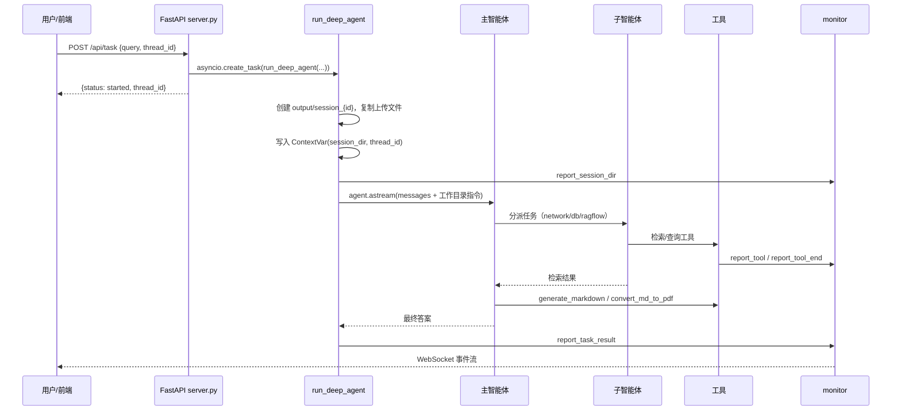

# Orbit-Agent（枢弈）项目记忆与迁移指南

> 本文件是项目完整的「记忆」沉淀：涵盖项目本质理解、技术栈、架构、实现流程、数据资产与完整迁移步骤。目标是让任何人在全新环境中仅凭本文件 + 仓库代码即可完成项目的完整重部署与运行。
>
> 更细粒度的函数级说明见 [CODE_WIKI.md](CODE_WIKI.md)。

---

## 目录

1. [项目概述](#1-项目概述)
2. [技术栈](#2-技术栈)
3. [整体架构](#3-整体架构)
4. [目录结构](#4-目录结构)
5. [核心执行流程](#5-核心执行流程)
6. [关键实现机制](#6-关键实现机制)
7. [模块职责与关键代码位置](#7-模块职责与关键代码位置)
8. [环境变量完整清单](#8-环境变量完整清单)
9. [依赖清单](#9-依赖清单)
10. [数据资产](#10-数据资产)
11. [完整迁移步骤](#11-完整迁移步骤)
12. [验证方式](#12-验证方式)
13. [常见问题与注意事项](#13-常见问题与注意事项)
14. [关键设计决策](#14-关键设计决策)
15. [公网部署](#15-公网部署)

---

## 1. 项目概述

**Orbit-Agent（枢弈）** 是一个基于 [DeepAgents](https://github.com/langchain-ai/deepagents) 框架的**对话式多智能体深度研究系统**（独立开发）。

核心能力：输入一个研究任务，由一个**主智能体**负责任务规划与调度，三个**专家子智能体**分别从三类信息源检索数据，最终汇总生成 **Markdown / PDF** 交付物，全过程通过 **WebSocket** 实时推送到 React 前端。

| 角色 | 职责 | 持有的工具 |
| --- | --- | --- |
| 主智能体（main agent） | 任务规划、子智能体调度、结果汇总、文件交付 | `read_file_content` / `generate_markdown` / `convert_md_to_pdf` |
| 网络搜索助手 | 检索互联网公开信息 | `internet_search`（Tavily） |
| 数据库查询助手 | 查询 MySQL 结构化业务数据 | `list_sql_tables` / `get_table_data` / `execute_sql_query` |
| RAGFlow 助手 | 检索企业私有知识库（非结构化文档） | `get_assistant_list` / `create_ask_delete` |

典型任务示例：

```text
结合公开资料、数据库信息和我上传的文档，整理一份机器人行业研究报告，并生成 PDF。
```

---

## 2. 技术栈

| 模块 | 技术 | 说明 |
| --- | --- | --- |
| 智能体框架 | DeepAgents 0.5.7 / LangGraph 1.1.10 / LangChain 1.2.17 | Orchestrator-Workers 编排 |
| 大模型接入 | OpenAI 兼容接口（默认通义千问 `qwen-max`） | 通过 `init_chat_model` 接入 |
| 检索与数据 | Tavily / MySQL / RAGFlow（ragflow-sdk） | 三类信息源 |
| 文档处理 | pypdf / python-docx / pandas / ReportLab | 读文档 + Markdown→PDF |
| 后端 | FastAPI + Uvicorn + WebSocket，Python 3.12 | 异步后台任务 |
| 前端 | React 19 + Vite + TypeScript + Ant Design 5 + Tailwind 4 | pnpm 管理 |
| 缓存 | Redis（可选，静默降级） | Tavily/RAGFlow 列表缓存 |
| 可观测性 | LangSmith（可选） | 零代码链路追踪 |
| 会话持久化 | SQLite checkpoint（`AsyncSqliteSaver` + WAL） | 断点恢复 |
| 工程化 | uv / pnpm / pre-commit / Docker Compose | 依赖与本地服务 |

---

## 3. 整体架构

采用 DeepAgents 的 **Orchestrator-Workers** 模式：主智能体是「调度中心」，子智能体是「信息获取 worker」，文件工具负责「最终交付」。

### 3.1 组件关系

```mermaid
flowchart TD
    FE[React 前端<br/>App / useDeepAgentSession] <-->|HTTP REST| API[FastAPI<br/>app/api/server.py]
    FE <-->|WebSocket /ws/{thread_id}| WS[ConnectionManager<br/>app/api/monitor.py]

    API -->|asyncio.create_task| RUN[run_deep_agent<br/>app/agent/main_agent.py]
    RUN --> MA[主智能体 DeepAgent<br/>create_deep_agent]
    MA -->|subagents| SUB1[网络搜索助手]
    MA -->|subagents| SUB2[数据库查询助手]
    MA -->|subagents| SUB3[RAGFlow 助手]
    MA -->|tools| FILE[文件工具<br/>read / generate_markdown / convert_md_to_pdf]

    SUB1 -->|internet_search| TAVILY[Tavily API]
    SUB2 -->|list/get/execute| MYSQL[MySQL deepsearch_db]
    SUB3 -->|get_assistant_list / create_ask_delete| RAGFLOW[RAGFlow 服务]

    MA -.->|monitor.report_*| MONITOR[ToolMonitor 单例]
    RUN -.->|ContextVar| CTX[app/api/context.py]
    MONITOR --> WS
```

### 3.2 会话隔离模型

- 每次任务对应一个唯一的 `thread_id`（同时也是 `session_id`）。
- 文件层面：每个会话独立使用 `app/output/session_{thread_id}/`；上传文件先落在 `app/updated/session_{thread_id}/`，执行前复制进工作目录。
- 上下文层面：`ContextVar` 携带 `thread_id` 与 `session_dir`，深层工具无需显式传参。
- 记忆层面：`AsyncSqliteSaver` 通过 `config={"configurable":{"thread_id": ...}}` 区分会话。

---

## 4. 目录结构

```text
orbit-agent/
├── app/                          # 后端主包
│   ├── agent/                    # 智能体组装
│   │   ├── subagents/            # 三个子智能体定义
│   │   ├── llm.py                # 模型初始化
│   │   ├── main_agent.py         # 主智能体组装 + run_deep_agent 执行入口
│   │   └── prompts.py            # 提示词加载
│   ├── api/                      # HTTP/WebSocket 接口层
│   │   ├── context.py            # ContextVar 会话上下文
│   │   ├── monitor.py            # 事件监控 + WebSocket 管理
│   │   └── server.py             # FastAPI 路由
│   ├── data/                     # SQLite checkpoint 数据库（运行期生成）
│   ├── prompt/prompts.yml        # 主/子智能体提示词
│   ├── ragflow/                  # RAGFlow 配置与调用示例
│   ├── tools/                    # 九类 LangChain 工具
│   └── utils/                    # 缓存 / 安全 / 路径解析 / 文档转换
├── docker/                       # 本地 MySQL 教学环境
│   ├── docker-compose.yaml
│   └── mysql/mysql.sql           # 药品/库存/销售初始化数据
├── docs/                         # 设计文档、CODE_WIKI、知识库示例
├── examples/                     # DeepAgents 章节示例脚本（15 个）
├── frontend/                     # React 前端
├── scripts/                      # 调试 / 测试 / 运维脚本
├── pyproject.toml                # Python 依赖与元信息
├── requirements.txt              # 依赖快照
├── uv.lock                       # uv 锁文件
├── CLAUDE.md                     # 协作指南
└── .env.example                  # 环境变量模板
```

---

## 5. 核心执行流程

### 5.1 端到端流程



### 5.2 主智能体的执行约束（prompts.yml 中定义）

1. 必须**先调用子智能体**获取信息，**再**调用文件生成工具。
2. 禁止在未获取信息前调用 `generate_markdown`。
3. 涉及生成文档时，Markdown 用 `generate_markdown`，PDF 需先生成 Markdown 再 `convert_md_to_pdf`。
4. 文档内容不少于 1000 字，且只允许在指定会话目录读写文件。

---

## 6. 关键实现机制

### 6.1 会话级上下文隔离（`app/api/context.py`）

用 `contextvars.ContextVar` 保存当前任务的 `thread_id` 与 `session_dir`：

- `set_session_context(path)` / `get_session_context()`
- `set_thread_context(thread_id)` / `get_thread_context()`
- `reset_session_context(...)`：任务结束恢复，避免请求间串台

### 6.2 事件驱动前后端联动（`app/api/monitor.py`）

- `ToolMonitor`（单例 `monitor`）：统一事件上报入口，事件类型 `tool_start` / `tool_end` / `assistant_call` / `assistant_end` / `task_result` / `task_cancelled` / `session_created` / `error`。
- `ConnectionManager`（`manager`）：以 `thread_id` 为 key 维护 WebSocket 连接。
- 事件 payload 统一为 `{"type":"monitor_event","event":...,"message":...,"data":...,"timestamp":...}`。

### 6.3 会话持久化（`app/agent/main_agent.py`）

- `get_checkpointer()`：懒加载 `AsyncSqliteSaver`（`aiosqlite` 连接 + `PRAGMA journal_mode=WAL`）。
- 数据库路径：`app/data/checkpoints.db`。
- 服务重启后可断点恢复历史会话上下文。

### 6.4 安全防护（`app/utils/safety.py`）

- SQL 注入防护：仅允许 `SELECT`/`SHOW`，拦截 DROP/DELETE/UPDATE 等，拦截注释/多语句。
- 行数/超时限制、表名白名单。
- 文件上传：大小限制、扩展名白名单、路径穿越防护（`resolve_path` + `is_relative_to`）。

### 6.5 检索缓存（`app/utils/cache.py`）

- Redis TTL 缓存 Tavily 搜索与 RAGFlow 助手列表。
- 连接失败/异常时静默降级，不影响主流程。

### 6.6 路径解析（`app/utils/path_utils.py`）

- `resolve_path(filename, session_dir)` 统一清洗模型返回的虚拟路径、上传路径、相对路径，尽量限制在会话目录内。

### 6.7 文档生成（`app/utils/word_converter.py`）

- Markdown → PDF 用 ReportLab，内置中文 CID 字体 `STSong-Light`，不依赖 Word/浏览器/系统 PDF 工具。

---

## 7. 模块职责与关键代码位置

| 文件 | 关键符号 | 职责 |
| --- | --- | --- |
| `app/api/server.py` | `app`、`run_task`、`cancel_task`、`upload_files`、`download_file`、`list_files`、`list_sessions`、`websocket_endpoint` | FastAPI 路由与后台任务调度 |
| `app/api/context.py` | `set/get/reset_session_context`、`set/get_thread_context` | 会话上下文 |
| `app/api/monitor.py` | `ToolMonitor`、`ConnectionManager`、`monitor`、`manager` | 事件上报与 WebSocket |
| `app/agent/llm.py` | `model` | 模型初始化 |
| `app/agent/prompts.py` | `main_agent_content`、`sub_agents_content` | 提示词加载 |
| `app/agent/main_agent.py` | `get_checkpointer`、`get_main_agent`、`run_deep_agent` | 主智能体组装与执行入口 |
| `app/agent/subagents/*.py` | `network_search_agent` / `database_query_agent` / `knowledge_base_agent` | 三个子智能体定义 |
| `app/tools/tavily_tool.py` | `internet_search` | 网络搜索 |
| `app/tools/db_tools.py` | `list_sql_tables` / `get_table_data` / `execute_sql_query` / `get_db_config` | 数据库查询 |
| `app/tools/ragflow_tools.py` | `get_assistant_list` / `create_ask_delete` | 知识库问答 |
| `app/tools/markdown_tools.py` | `generate_markdown` | 生成 Markdown |
| `app/tools/pdf_tools.py` | `convert_md_to_pdf` | Markdown→PDF |
| `app/tools/upload_file_read_tool.py` | `read_file_content` | 读上传文件 |
| `app/utils/cache.py` | `get_redis_client` / `cache_get` / `cache_set` 等 | Redis 缓存 |
| `app/utils/safety.py` | `validate_sql_query` / `limit_sql_rows` / `validate_table_name` / `validate_file_upload` / `get_security_config` | 安全校验 |
| `app/utils/path_utils.py` | `resolve_path` | 路径解析 |
| `app/utils/word_converter.py` | `convert_md_to_pdf` | Markdown→PDF 底层 |
| `app/ragflow/rag_config.py` | `_load_ragflow_env` | RAGFlow 配置 |
| `app/prompt/prompts.yml` | 主/子智能体提示词 | 行为约束 |

前端核心：

| 文件 | 关键符号 | 职责 |
| --- | --- | --- |
| `frontend/src/hooks/useDeepAgentSession.ts` | `useDeepAgentSession` | 会话状态、WebSocket、文件刷新 |
| `frontend/src/lib/api.ts` | `startTask` / `cancelTask` / `uploadSessionFiles` / `listSessionFiles` / `getDownloadUrl` | REST 封装 |
| `frontend/src/lib/config.ts` | `API_BASE_URL` / `WS_BASE_URL` | 环境配置 |
| `frontend/src/lib/thread.ts` | `createThreadId` / `getStoredThreadId` / `storeThreadId` | thread_id 管理 |
| `frontend/src/App.tsx` | `App` | 根组件 |

---

## 8. 环境变量完整清单

模板见 `.env.example`。**迁移时必填**：`OPENAI_API_KEY`、`TAVILY_API_KEY`。

### 8.1 LLM

| 变量 | 说明 |
| --- | --- |
| `OPENAI_BASE_URL` | OpenAI 兼容接口地址 |
| `OPENAI_API_KEY` | 大模型密钥 |
| `LLM_QWEN_MAX` | 模型名（默认 `qwen-max`） |

### 8.2 检索

| 变量 | 说明 |
| --- | --- |
| `TAVILY_API_KEY` | Tavily 搜索密钥 |
| `RAGFLOW_API_URL` / `RAGFLOW_API_KEY` | RAGFlow 服务地址与密钥 |

### 8.3 MySQL

| 变量 | 说明 |
| --- | --- |
| `MYSQL_USER` / `MYSQL_PASSWORD` / `MYSQL_DATABASE` / `MYSQL_HOST` | 连接配置 |
| `MYSQL_PORT` | 默认 3307（避免与 3306 冲突） |
| `MYSQL_CHARSET` / `MYSQL_COLLATION` / `MYSQL_SQL_MODE` | `utf8mb4` / `utf8mb4_unicode_ci` / `TRADITIONAL` |

### 8.4 缓存（Redis，可选）

| 变量 | 默认 | 说明 |
| --- | --- | --- |
| `REDIS_ENABLED` | `false` | 是否启用 |
| `REDIS_URL` | `redis://localhost:6379/0` | 连接地址 |
| `SEARCH_CACHE_TTL` | `3600` | 缓存 TTL（秒） |

### 8.5 安全

| 变量 | 默认 | 说明 |
| --- | --- | --- |
| `ALLOWED_SQL_TABLES` | 空 | 表名白名单（空=不限制） |
| `SQL_QUERY_TIMEOUT` | `5` | SQL 超时（秒） |
| `SQL_MAX_ROWS` | `100` | 单次查询最大行数 |
| `MAX_UPLOAD_MB` | `20` | 上传大小上限 |
| `ALLOWED_FILE_EXTENSIONS` | `.txt,.md,.pdf,.docx,.xlsx,.csv` | 扩展名白名单 |

### 8.6 可观测性（LangSmith，可选）

| 变量 | 说明 |
| --- | --- |
| `LANGSMITH_API_KEY` / `LANGSMITH_TRACING` / `TRACING_PROVIDER` | 链路追踪 |

### 8.7 会话持久化

| 变量 | 默认 | 说明 |
| --- | --- | --- |
| `CHECKPOINT_DB_PATH` | `app/data/checkpoints.db` | checkpoint 数据库路径 |
| `SESSION_EXPIRE_DAYS` | `30` | 会话过期天数 |

### 8.8 前端（`frontend/.env` 或 `.env.local`）

| 变量 | 说明 |
| --- | --- |
| `VITE_API_BASE_URL` | 后端地址（默认 `http://localhost:8000`） |
| `VITE_WS_BASE_URL` | WebSocket 地址（默认由 API 地址推导） |

---

## 9. 依赖清单

### 9.1 后端核心依赖（`pyproject.toml`）

| 依赖 | 版本 | 用途 |
| --- | --- | --- |
| `deepagents` | `==0.5.7` | 多智能体框架 |
| `langchain` / `langgraph` / `langchain-openai` | `1.2.17` / `1.1.10` / `1.2.1` | 基础设施 |
| `langgraph-checkpoint-sqlite` | `>=3.1.0` | 会话持久化 |
| `fastapi` / `uvicorn[standard]` | `>=0.100` | Web 服务 |
| `tavily-python` | `==0.7.24` | 网络搜索 |
| `mysql-connector-python` | `>=8.0` | MySQL |
| `ragflow-sdk` | `>=0.1` | RAGFlow |
| `redis` | `>=8.1` | 缓存 |
| `pydantic` / `pyyaml` / `python-dotenv` / `aiofiles` / `aiosqlite` | — | 基础设施 |
| `pypdf` / `python-docx` / `pandas` / `reportlab` / `openpyxl` | — | 文档处理 |
| `markdown` / `python-multipart` / `requests` / `typing-extensions` | — | 基础设施 |

> 需要 Python **3.12**（`requires-python = ">=3.12,<3.13"`）。

### 9.2 前端依赖（`frontend/package.json`）

- 运行时：`react` 19、`react-dom` 19、`antd` 5、`@ant-design/icons`、`react-markdown` + `remark-gfm`、`tailwindcss` 4。
- 开发：`vite` 7、`typescript` 5.8、`@vitejs/plugin-react`。
- 包管理器：`pnpm@10.33.0`。

---

## 10. 数据资产

### 10.1 MySQL 业务库（`docker/mysql/mysql.sql`）

- 库名：`deepsearch_db`，字符集 `utf8mb4`。
- 三张表：

| 表 | 说明 | 数据量 |
| --- | --- | --- |
| `drugs` | 药品主数据（`drug_id` PK、通用名/商品名/规格/剂型/厂家/治疗领域等） | 50 条 |
| `inventory` | 库存批次（关联 `drug_id`） | 150 条 |
| `sales_records` | 销售记录（关联 `drug_id`） | 100 条 |

> 数据为教学模拟数据。Docker 首次初始化（空 volume）自动导入；已有 volume 不会重跑，需重建 volume。

### 10.2 会话 checkpoint（`app/data/checkpoints.db`）

- SQLite 数据库，由 `AsyncSqliteSaver` 管理。
- **迁移会话时**：若要保留历史会话/断点恢复，需连同该 `.db` 文件一起迁移。

### 10.3 RAGFlow 知识库示例文档（`docs/knowledge_base/`）

- `电商行业/`：数字人电商直播白皮书、全球电商行业 AI 应用研究报告。
- `金融行业/`：央行货币政策执行报告、BlackRock 全球投资展望、长江商学院投资者情绪调查。
- 使用时需配置可用的 RAGFlow 服务并在其中建好对应「聊天助手」绑定这些知识库。

---

## 11. 完整迁移步骤

### 11.1 前置条件

- **Python 3.12**（不支持 3.13）+ [uv](https://docs.astral.sh/uv/)
- **Node.js + pnpm**
- **Docker**（用于本地 MySQL 教学库）
- **大模型 API Key**（OpenAI 兼容）、**Tavily API Key**；RAGFlow 与 Redis 为可选依赖

### 11.2 获取代码

```bash
git clone https://github.com/wjb412530/Orbit-Agent.git
cd Orbit-Agent
```

### 11.3 后端搭建

```bash
# 1. 安装依赖
uv sync

# 2. 配置环境变量
cp .env.example .env   # 然后编辑 .env，填入 OPENAI_API_KEY、TAVILY_API_KEY 等

# 3. 启动本地 MySQL 教学库
docker compose -f docker/docker-compose.yaml up -d

# 4. 启动后端服务
uv run uvicorn app.api.server:app --host 0.0.0.0 --port 8000 --reload
```

### 11.4 前端搭建

```bash
cd frontend
pnpm install
pnpm dev    # 开发模式（vite 代理 /api → 8000、/ws → ws:8000）
pnpm build  # 生产构建
```

### 11.5 数据迁移要点

| 数据 | 迁移方式 |
| --- | --- |
| MySQL 业务数据 | 重新 `docker compose up` 会在空 volume 上自动导入 `mysql.sql`；或直接迁移 Docker volume / `mysqldump` |
| 会话 checkpoint | 拷贝 `app/data/checkpoints.db`（如需断点续跑） |
| RAGFlow 知识库 | 上传 `docs/knowledge_base/` 下的文档到目标 RAGFlow，创建对应聊天助手，配置 `RAGFLOW_API_URL` / `RAGFLOW_API_KEY` |

### 11.6 接口启动自检

```bash
# 后端健康（FastAPI 自带文档）
curl http://localhost:8000/docs

# 提交一个测试任务
uv run python scripts/submit_test_task.py
```

---

## 12. 验证方式

- **后端**：`POST /api/task` 能返回 `{"status":"started","thread_id":...}`，且 WebSocket 能收到 `session_created` / `tool_start` / `task_result` 等事件。
- **前端**：打开 `http://localhost:5173`，侧边栏显示「WebSocket 已连接」，提交任务后能看到事件流与文件列表。
- **示例任务**：

```text
从数据库中查询心血管药品的库存情况，并生成 Markdown 报告。
搜索 2026 年 AI 在电商行业的应用趋势，并结合知识库资料生成一份 PDF。
请先读取我上传的行业报告，再结合公开资料整理一份研究摘要。
```

- **示例脚本**：`uv run python examples/1-deep-agent-quickstart-search.py`。
- **自测脚本**（`scripts/`）：`test_security.py`、`test_redis_cache.py`、`test_checkpointer.py`、`test_sessions_api.py` 等。

---

## 13. 常见问题与注意事项

1. **Python 版本**：必须 3.12，3.13 不兼容。
2. **MySQL 端口**：默认 3307，避免与本机 3306 冲突；如需改端口，需同步改 `.env` 的 `MYSQL_PORT`。
3. **数据库初始化**：Docker volume 已存在时不会重跑 `mysql.sql`；改数据后需 `docker compose down -v` 重建。
4. **RAGFlow 是外部服务**：docker-compose 里没有 RAGFlow；需要私有知识库能力的任务依赖可用的 RAGFlow 实例。
5. **文件路径约束**：所有生成文件必须落在 `app/output/session_{thread_id}/`；读取上传文件时用文件名（不带路径前缀）。
6. **同一 thread_id 串行**：同一 `thread_id` 同时只允许一个活跃任务，新任务会取消旧任务。
7. **Redis 可选**：`REDIS_ENABLED=false` 时完全离线可用。
8. **上传文件读取**：`read_file_content` 支持 `.md/.txt/.docx/.pdf/.xlsx/.xls`。

---

## 14. 关键设计决策

| 决策 | 理由 |
| --- | --- |
| 主智能体不直接持检索工具，通过子智能体隔离 | 控制上下文规模，信息获取逻辑内聚 |
| 用 `ContextVar` 传会话上下文 | 深层工具无需层层传参，并发会话互不串台 |
| 事件统一走 `monitor` + WebSocket | 前端实时观察执行过程，解耦上报与展示 |
| `InMemorySaver` → `AsyncSqliteSaver` | 会话持久化，支持断点恢复 |
| 文件工具统一走 `resolve_path` | 防止模型使用任意绝对路径导致的越界读写 |
| 缓存/观测/Redis 均可选且静默降级 | 保证最小依赖也能跑通 |
| Markdown→PDF 用 ReportLab | 跨平台，不依赖 Word/浏览器 |


---

## 15. 公网部署

项目为「单进程内存态」架构（`active_tasks`、WebSocket 连接、`checkpointer` 均保存在单个进程内），只能垂直扩展，因此公网部署采用「中档」方案：**单台轻量云服务器 + Docker Compose + Caddy**（而非 PaaS/内网穿透的「轻」档，或 K8s/全托管的「重」档）。

| 档位 | 做法 | 取舍 |
| --- | --- | --- |
| 轻 | 内网穿透 / PaaS | 依赖本机常开、冷启动、WebSocket 支持差，不采用 |
| 中 | 单机 + Compose + Caddy | 与单机内存态架构匹配，长期稳定在线，采用 |
| 重 | K8s / 全托管云 | 多副本破坏 WebSocket 会话粘性，过度设计 |

### 15.1 部署文件清单

| 文件 | 作用 |
| --- | --- |
| `docker/backend.Dockerfile` | uv 构建后端镜像（按 uv.lock 精确安装依赖） |
| `docker/caddy.Dockerfile` | 多阶段构建前端静态资源 + Caddy 网关 |
| `Caddyfile` | 自动 HTTPS、静态托管、`/api` `/ws` 反代 |
| `docker-compose.prod.yml` | 编排 backend + mysql + redis + caddy |
| `.env.production` | 生产环境变量模板（含 `DOMAIN`） |

### 15.2 部署拓扑

```text
公网 80/443
   ▼
[ Caddy ] ── 前端静态 dist + SPA 回退
   │  /api/* 、/ws/* 反向代理
   ▼
[ backend :8000 ] ──┬─ [ mysql :3306 ]    （仅容器内网）
                    └─ [ redis :6379 ]    （可选）
```

### 15.3 部署步骤

1. 购买轻量云（Ubuntu 22.04），安装 Docker + Compose v2。
2. 域名加 A 记录指向服务器 IP；防火墙放行 80/443（和 SSH 22）。
3. `git clone https://github.com/wjb412530/Orbit-Agent.git`
4. `cp .env.production .env`，填入真实密钥与 `DOMAIN=你的域名`。
5. `docker compose -f docker-compose.prod.yml up -d --build`
6. 首次自动：构建镜像 → MySQL 导入 `docker/mysql/mysql.sql` → Caddy 签发 HTTPS 证书。
7. 验证：`https://你的域名` 打开前端、侧边栏 WebSocket 已连接、任务能跑通。

### 15.4 关键约束（为什么这么做）

- **单 worker**：`active_tasks` / WebSocket 连接都在进程内存，多 worker 会导致任务与事件推送跨进程失联。
- **前端构建期注入 `VITE_API_BASE_URL`**：`config.ts` 默认回退 `http://localhost:8000`，生产必须注入公共域名。
- **用 uv 而非 requirements.txt 构建**：后者缺 `redis` / `aiosqlite` / `langgraph-checkpoint-sqlite`。
- **Caddy 自动 HTTPS + WebSocket**：`{$DOMAIN}` 自动签发 Let's Encrypt 证书，`/ws` 自动处理 Upgrade。
- **MySQL 不映射宿主端口 + `MYSQL_ROOT_HOST="%"`**：内网更安全，同时支持 backend 跨容器以 root 连接。
- **命名卷外置状态**：MySQL 数据、checkpoint、output/updated 挂卷持久化，容器重建不丢数据。
- **密钥 env_file 不进镜像/仓库**：`.env` 在服务器上手动创建，绝不 COPY 进镜像、绝不上 Git。
